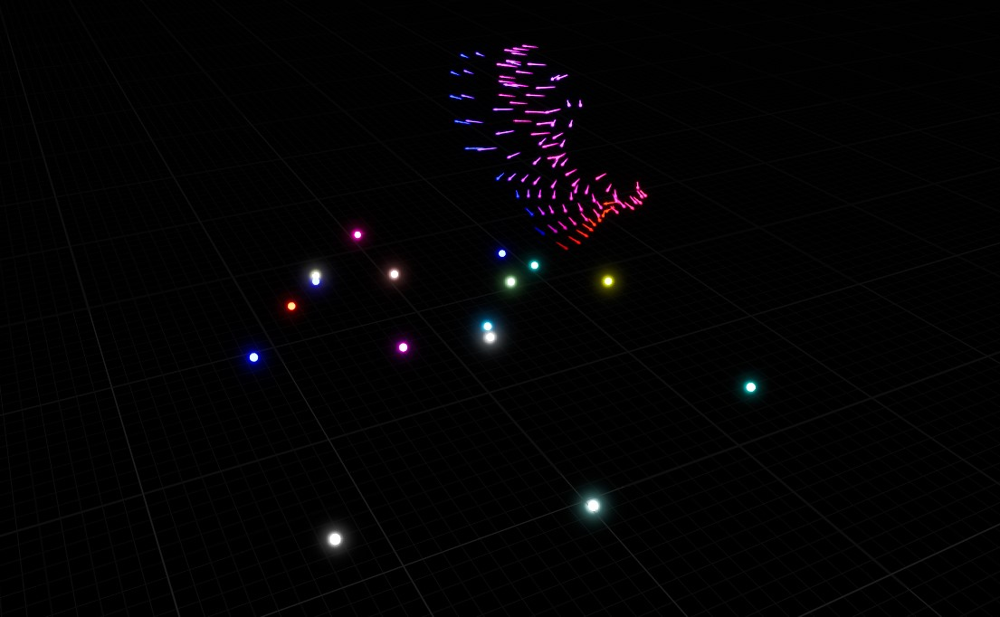

# Technical Task

## Click to watch the Demo Reel

### Resources

TMap knowledge for Unreal Engine
https://www.youtube.com/watch?v=ik3Ju2CRg40

Unreal Engine working with curves.
https://forums.unrealengine.com/t/c-dynamic-curves/141555
- UE5 is using RealCurves and RichCurves as UCurveBase has deprecated functions

Unreal Engine 5.3 - Introduction To HLSL & Scratch Pad In Niagara FX
https://www.youtube.com/watch?v=ZNPzpXKvyL4
